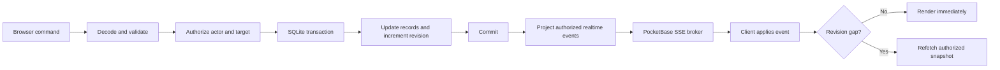

# Social Games Hoster Rebuild Plan

## Document purpose

This document is the implementation handoff for a complete rebuild of Social Games
Hoster. It is intended for an engineer who has no prior knowledge of the repository
or the product. It records:

- what the current application does;
- why it is being replaced;
- the product decisions already made with the owner;
- the target architecture, data model, contracts, and security boundaries;
- the required implementation order;
- the tests and measurable acceptance criteria for completion.

This is a clean rebuild. Backwards compatibility with the existing PostgreSQL
database and API is explicitly not required.

## Executive summary

Replace the current .NET/PostgreSQL/Node/SignalR application with:

- one Go process;
- PocketBase embedded as a Go framework;
- PocketBase's embedded SQLite database, authentication primitives, file storage,
  migrations, structured logs, and Server-Sent Events;
- a Svelte 5 static single-page application embedded into the Go executable;
- one Windows installer for non-technical hosts;
- a custom game-master UI rather than the PocketBase superuser UI.

At runtime the host must not need .NET, Node.js, PostgreSQL, Docker, nginx, or a
separate logging application. The installed application is one console-free
executable plus a mutable data directory under the Windows user profile.

The rebuilt product is a **game-master toolkit**, not a scriptable game runtime. It
manages reusable player profiles, role assignments, visibility, phase progression,
timers, chat policy, outcomes, achievements, and live updates. The game master
resolves abilities and win conditions manually. Arbitrary ruleset scripting and
automatic ability resolution are out of scope.

PocketBase is a suitable foundation because the deployment is a single local
server with at most 30 players. It provides embedded SQLite, auth collections,
files, migrations, logs, and realtime subscriptions without separate services.
PocketBase remains pre-1.0, so its version must be pinned and upgrades must be
deliberate.

## Fixed product decisions

These decisions were made with the product owner and should not be reopened during
implementation unless a technical blocker is discovered.

| Topic | Decision |
|---|---|
| Backend | Go with PocketBase embedded as a framework |
| PocketBase version | Pin `github.com/pocketbase/pocketbase` to `v0.39.9` |
| Browser SDK | Pin the official `pocketbase` package to `0.27.0` |
| Database | PocketBase's embedded SQLite in WAL mode |
| Existing data | Start clean; no PostgreSQL importer |
| Runtime shape | One server process and one installed application executable |
| Distribution | Windows installer, not a developer script or Docker |
| Supported host OS | Windows 10/11 x64 for the first release |
| Network | Local trusted private LAN over HTTP |
| Game-master device | Any device on the LAN may sign into the admin dashboard |
| Game-master accounts | Multiple named accounts with individual passwords and audit attribution |
| Player identity | Reusable passwordless profile bound to a browser/device token |
| New/replacement device | Requires game-master approval |
| Profile richness | Avatar, biography, appearance choice, aggregate statistics, achievements, and private game history |
| Profile visibility | Party-visible summary; detailed game and role history is private |
| Simultaneous sessions | Exactly one live game; unlimited drafts and archives |
| Finished games | Outcome review followed by immutable archive |
| Rules engine | Game-master toolkit; no arbitrary scripting or automatic ability execution |
| Role assignment | Manual assignment plus constrained random assignment |
| Composition model | Player-count bands, category/role slots, uniqueness, dependencies, exclusions, and conditional slot modifiers |
| Phase/timer coupling | A phase may suggest a timer; the game master advances phases manually |
| Chat | Game-master DMs and announcements always exist; general, team, and player DMs are ruleset-controlled |
| Chat phase behavior | Ruleset defaults with per-phase overrides |
| Sender identity | Ruleset/room policy chooses names, aliases, roles/teams, or anonymous seat numbers |
| Moderation | Game masters can read and moderate every room; this is disclosed to players |
| Ruleset versions | Published versions are immutable; edits create successor drafts |
| Ruleset portability | Versioned bundle containing data, images, and audio |
| Achievements | Defined by rulesets and manually awarded by a game master |
| Audio cues | Targetable to all players, a team, one player, or game masters |
| Diagnostics | Core error logging is always on; detailed diagnostics require a debug build or opt-in flag |
| Visual design | Preserve and reimplement the parchment theme; replace all existing animation implementations |
| Capacity target | Up to 30 connected players, with load-test headroom |

## Current repository context

### Repository layout

The current repository contains:

- `API/`: ASP.NET Core minimal API host, auth, filters, logging, SignalR hubs, and
  feature endpoints.
- `API.DataAccess/`: Entity Framework Core context, repository abstraction,
  PostgreSQL migrations, and seeders.
- `API.Domain/`: entities, timer implementation, `Result` types, and validation
  primitives.
- `API.LogViewer/`: a separate Blazor-style project for viewing debug log data.
- `Web/`: SvelteKit 2/Svelte 5 application using an adapter-node runtime.
- `install.bat`: installs PostgreSQL, the .NET SDK, and Node.js through `winget`.
- `run.bat`: starts PostgreSQL, the ASP.NET API, and the Svelte development server
  in separate terminal windows.

The current aggregate contains roughly 17,000 lines of C#, TypeScript, and Svelte
source, much of which is infrastructure or duplicated transport code.

### Current runtime topology

The documented/current direction requires several runtime pieces:

1. ASP.NET Core API;
2. Node-hosted SvelteKit server;
3. PostgreSQL;
4. historically Docker/nginx, or replacement batch scripts;
5. a separate log viewer when detailed logs are needed.

This topology is inappropriate for a low-end Windows laptop used by a
non-technical party host.

### Current domain model

The Entity Framework model currently contains:

- `Ruleset`
  - name and description;
  - roles;
  - abilities;
  - round phases.
- `Role`
  - name and description;
  - associated abilities;
  - role-to-role knowledge;
  - assigned players.
- `Ability`
  - name and description.
- `RoleKnowledge`
  - source role;
  - target role;
  - knowledge type (`Role` or `Alignment`).
- `RoundPhase`
  - name, description, and order.
- `GameSession`
  - ruleset;
  - participants;
  - round number and timestamps;
  - current phase;
  - winners;
  - status;
  - chat channels.
- `Player`
  - name;
  - role;
  - game;
  - elimination state;
  - visibility relationships;
  - IP address;
  - chat memberships.
- `ChatChannel`, `ChatChannelMembership`, and `ChatMessage`.

The current model couples a player identity directly to one game. The rebuild must
separate a reusable profile from a per-game participation record.

### Existing backend capabilities

The current endpoint surface includes:

- admin and player login;
- current-player lookup;
- player create/read/update/delete;
- role create/read/update and ability assignment;
- ability create/read/update;
- ruleset list/detail reads;
- game create/list/detail/duplicate/delete;
- active-game list;
- participant updates;
- ruleset selection;
- start/stop game;
- start round/current round;
- mark winners;
- read global chat;
- create/read/send/delete chat data;
- start/pause/resume/adjust/stop a global in-memory timer;
- SignalR notifications for auth, games, roles, abilities, players, rulesets, chat,
  and timers.

The frontend currently provides:

- active-game lobby;
- player name entry;
- player role/ability card;
- role-card privacy toggle;
- global chat;
- admin login;
- admin game and ruleset lists;
- game creation;
- roster and role assignment;
- winner selection;
- player removal;
- timer control;
- a partially implemented ruleset creator.

### Existing seeded examples

The database seeders create:

- a Town of Salem-style ruleset with Town, Mafia, and Neutral roles;
- a Blackjack ruleset with Player and Dealer roles;
- a running game with test players.

The rebuild must preserve Town of Salem and Blackjack as demonstration ruleset
bundles and automated test fixtures. They remain manually resolved examples rather
than fully automated game implementations.

### Important known gaps

The TODO lists in `API/Program.cs` and `Web/todo.txt`, along with incomplete
implementations, identify these gaps:

- inconsistent or missing authorization on endpoints;
- insecure hard-coded JWT secrets and issuer values;
- admin credentials stored in a plain INI file;
- player logout not implemented;
- player visibility effectively returns `true`;
- participant and game lifecycle rules are incomplete;
- finish-round is a stub;
- timer is global, in-memory, and lost on restart;
- timer completion/adjustment semantics are inconsistent;
- missing or incomplete game-master DMs and team/player chat;
- no reliable player kick/token invalidation flow;
- ruleset creation is not persisted;
- ruleset detail/management pages are incomplete;
- API failures have sometimes produced HTTP 200;
- extensive cache invalidation is required because mutable query results are
  cached;
- one SignalR hub/client wrapper exists per feature;
- the generated frontend SDK has one file per endpoint and repeats boilerplate;
- current chat events require an additional message fetch;
- player names are anonymized in one specific hard-coded way rather than through a
  game policy;
- no test project or configured frontend test runner exists;
- no production-grade clean install/update experience exists.

The rebuild should not port these structures verbatim. It should preserve the user
capabilities while eliminating the architectural causes of the problems.

### Current visual language

`Web/DESIGN.MD` defines a medieval parchment style:

- parchment cream surfaces;
- dark ink text;
- crimson accents;
- Cinzel headings and IM Fell English body typography;
- sharp framed components;
- tactile but fast interactions.

Preserve this identity. Do not preserve the current multi-stage role reveal,
manual DOM manipulation, chained timeouts, backdrop-heavy effects, or other
animation implementations. New motion must be optional, short, CSS-driven, and
compatible with `prefers-reduced-motion`.

## Goals and non-goals

### Goals

- A non-technical host can install and start the app without installing
  dependencies or opening a terminal.
- Players join from a phone using the displayed IP/port link or QR code.
- An approved returning phone retains its profile without a password.
- Every relevant state change is reflected immediately on authorized clients.
- Secret roles, private messages, and real identities in anonymous rooms never
  leak to unauthorized clients.
- The active game, timer, roster, chat, and role state survive application restart
  and Windows sleep.
- The game-master workflow is complete from ruleset authoring through archived
  results.
- The application remains responsive on a dual-core, 4 GB Windows laptop.
- The codebase is materially smaller and easier to understand than the current
  implementation.
- Vertical slices and railway-oriented error handling remain visible in the
  architecture.
- Debugging remains excellent without imposing verbose logging overhead during
  normal play.

### Non-goals

- No legacy PostgreSQL data import.
- No API compatibility with the .NET endpoints or generated SDK.
- No Docker or server-farm deployment target.
- No horizontal scaling or multi-process coordination.
- No internet account system or cloud synchronization.
- No HTTPS certificate onboarding for the LAN release.
- No arbitrary ruleset scripting.
- No automatic execution of abilities, targeting logic, deaths, or win conditions.
- No end-to-end encryption of player chat from the local host/game master.
- No native mobile application.
- No macOS or Linux installer in the first release.
- No fully offline PWA behavior; the local server is required.

## Target technology and dependency policy

### PocketBase

Use PocketBase as an imported Go package, not as an unmodified downloaded
executable with loose hook files.

Required uses:

- embedded SQLite data and auxiliary/log databases;
- auth collections and token generation;
- record/file storage;
- compiled Go migrations;
- custom HTTP routes;
- request/auth hooks;
- structured log storage;
- custom realtime messages through the subscription broker;
- scheduled cleanup and backup jobs.

Do not expose generic record CRUD to the application frontend. Domain collections
must have locked API rules; custom routes enforce all business and projection
rules.

PocketBase `v0.39.9` is pre-1.0. Therefore:

- commit exact Go module and npm lockfiles;
- disable automated dependency updates for PocketBase;
- review every PocketBase upgrade guide and changelog;
- create a data backup before running upgraded migrations;
- run the full integration, realtime, and installer suites before accepting an
  upgrade;
- never allow the Windows installer to silently change PocketBase versions without
  an application release.

Primary documentation:

- <https://pocketbase.io/docs/>
- <https://pocketbase.io/docs/go-overview/>
- <https://pocketbase.io/docs/go-migrations/>
- <https://pocketbase.io/docs/go-realtime/>
- <https://pocketbase.io/docs/go-testing/>

### Frontend

Retain Svelte 5 and TypeScript, but remove the Node runtime:

- switch SvelteKit from `adapter-node` to `adapter-static`;
- configure SPA fallback to `index.html`;
- disable SSR for application pages;
- emit content-hashed assets;
- embed the production build using Go `embed.FS`;
- serve the SPA with index fallback and correct cache headers;
- use one official PocketBase JavaScript client instance;
- call custom APIs through `pb.send<T>()`;
- keep a small handwritten `contracts.ts` and generic API adapter rather than
  generating dozens of endpoint files.

Node.js remains a developer/build dependency only.

### Windows packaging

Use Inno Setup to produce a single installer EXE.

The installed application:

- is built with the Windows GUI subsystem so no console window appears;
- contains the embedded static frontend and Go migrations;
- uses a tray icon;
- enforces one running instance;
- opens the browser automatically;
- can be shut down cleanly from the tray;
- writes mutable data outside the installation directory.

Code signing should be supported in the release pipeline. If no certificate is
available, document the expected SmartScreen warning rather than attempting to
bypass it.

## Proposed repository organization

Keep vertical slices compact. Do not create one file per trivial endpoint.

```text
Host/
  cmd/socialgameshoster/
    main.go
  internal/
    platform/
      auth/
      database/
      diagnostics/
      http/
      logging/
      realtime/
      result/
      windows/
    features/
      setup/
      profiles/
      rulesets/
      games/
      chat/
      timer/
      achievements/
  migrations/
  fixtures/
    town-of-salem.sghrules
    blackjack.sghrules
  embedded/
    web/                 # generated Web build, not hand-edited

Web/
  src/
    lib/
      api/
      components/
      design/
      stores/
    features/
      setup/
      auth/
      profiles/
      rulesets/
      games/
      chat/
      timer/
      diagnostics/
    routes/

packaging/
  windows/
  scripts/
```

Within a backend feature package, group related routes and contracts. A typical
slice may contain:

```text
routes.go
contracts.go
commands.go
queries.go
policy.go
events.go
*_test.go
```

Avoid a shared "utils" dumping ground. Move code into platform/shared packages only
after at least two slices genuinely require the same abstraction.

## Data model

PocketBase supplies standard `id`, `created`, and `updated` fields. Application
fields below are in addition to those fields.

All domain collection list/view/create/update/delete rules must be locked. The only
browser-facing exception is the PocketBase authentication protocol if it is
explicitly used by the custom login adapter. Prefer custom auth routes for a
uniform error envelope.

### `game_masters` auth collection

Purpose: named game-master accounts and owner management.

Fields:

- `username`: required, normalized, unique, password identity field;
- `display_name`: required;
- `is_owner`: required boolean;
- `active`: required boolean, default `true`;
- `last_login_at`: optional datetime.

Rules:

- password auth enabled using `username`;
- token duration 12 hours;
- only one active owner is required, though ownership may be transferred;
- only the owner can create, disable, reset, delete, or transfer ownership of
  game-master accounts;
- ordinary game masters can perform all game, ruleset, profile moderation, chat,
  outcome, and achievement operations;
- account changes rotate the affected record's token key.

Indexes:

- unique normalized username;
- partial/validated invariant for at least one active owner enforced in application
  transactions.

### `player_profiles` auth collection

Purpose: reusable player identity independent of games.

Fields:

- `display_name`: required, 2–32 visible characters;
- `normalized_name`: required hidden field, unique;
- `avatar`: optional protected image file;
- `bio`: optional plain text, maximum 280 characters;
- `accent`: optional validated design-token key;
- `active`: required boolean;
- `approved_at`: datetime;
- `approved_by`: relation to `game_masters`;
- `last_seen_at`: datetime.

Rules:

- email is optional/unused;
- password auth, OAuth, OTP, and email flows are disabled;
- assign a random unexposed password because the record is an auth model;
- application code creates/refreshes auth tokens;
- token duration 180 days;
- a valid known device refreshes its token on launch;
- rotating `tokenKey` revokes old devices.

Name normalization:

- Unicode NFKC;
- trim leading/trailing whitespace;
- collapse internal repeated whitespace;
- compare case-insensitively;
- allow letters, numbers, spaces, apostrophes, hyphens, and a small documented set
  of safe punctuation;
- reject control characters and bidi control characters.

Avatar rules:

- JPEG, PNG, or WebP only;
- client crops/resizes to at most 512×512;
- server verifies decoded image type and dimensions;
- maximum 1 MB;
- never render user-provided SVG or HTML.

### `profile_requests` base collection

Purpose: approve new profiles and recover an existing profile on a replacement
device.

Fields:

- `request_type`: `new` or `recover`;
- `requested_name`: requested display name;
- `normalized_name`: normalized lookup value;
- `profile`: optional relation for recovery/approved new profile;
- `secret_hash`: hash of a high-entropy one-time secret;
- `status`: `pending`, `approved`, `rejected`, `expired`, or `consumed`;
- `expires_at`: required datetime;
- `decided_by`: optional game-master relation;
- `decided_at`: optional datetime;
- `consumed_at`: optional datetime;
- `rejection_reason`: optional safe user-facing text.

Flow:

1. A phone submits a name and receives `requestId` plus a random secret.
2. The server stores only the secret hash.
3. Game masters receive a pending-request realtime event.
4. Approval creates a new profile or rotates the recovered profile's token key.
5. The phone receives an approved event and calls the redeem route with the secret.
6. Redeem atomically verifies the hash, generates an auth token, and marks the
   request consumed.
7. A token is never stored in `profile_requests`.
8. Pending requests expire after 10 minutes and are cleaned automatically.

If a normalized name already exists, a new request becomes a recovery request; it
must never silently claim the existing profile.

### `rulesets` base collection

Purpose: logical identity across immutable versions.

Fields:

- `slug`: stable unique identifier;
- `name`: current display name for lists;
- `archived`: boolean;
- `latest_published_version`: optional relation to `ruleset_versions`;
- `created_by`: game-master relation.

Rules:

- a ruleset cannot be hard-deleted while any version is referenced;
- archive hides it from new-game defaults without changing old games;
- seeded logical rulesets behave like normal rulesets but begin with a published
  version.

### `ruleset_versions` base collection

Purpose: draft and immutable published definitions.

Fields:

- `ruleset`: required relation;
- `version_number`: positive integer;
- `state`: `draft` or `published`;
- `schema_version`: integer, initially `1`;
- `definition`: required JSON matching `RulesetDefinitionV1`;
- `definition_checksum`: SHA-256 of the canonical definition;
- `created_by`: game-master relation;
- `published_by`: optional game-master relation;
- `published_at`: optional datetime;
- `source_metadata`: optional JSON describing imported bundle/version.

Rules:

- allow at most one successor draft for a logical ruleset;
- draft records may be updated through validated application routes;
- publishing validates all references and asset keys in one transaction;
- published records are immutable;
- editing a published version creates a new draft with the next version number;
- games reference published versions only;
- referenced versions cannot be deleted.

Indexes:

- unique `(ruleset, version_number)`;
- unique draft per logical ruleset using an SQLite partial index.

### `ruleset_assets` base collection

Purpose: images and audio referenced by a ruleset version.

Fields:

- `ruleset_version`: required relation;
- `asset_key`: stable ruleset-local key;
- `kind`: `image` or `audio`;
- `file`: protected PocketBase file;
- `mime_type`: verified MIME type;
- `checksum`: SHA-256;
- `metadata`: JSON containing image dimensions or audio duration.

Rules:

- unique `(ruleset_version, asset_key)`;
- draft assets may be replaced or removed if no definition reference remains;
- published assets are immutable;
- access is granted only to authenticated profiles participating in a game using
  that version, authenticated game masters, or party members viewing an allowed
  public profile/achievement;
- assets are fetched lazily and cached by checksum.

### `games` base collection

Purpose: game lifecycle and durable shared state.

Fields:

- `name`: friendly host-defined name;
- `status`: `draft`, `lobby`, `running`, `paused`, `review`, or `archived`;
- `ruleset_version`: required relation;
- `ruleset_snapshot`: immutable JSON copy of the published definition;
- `join_code`: six-character human-readable code while joining is open;
- `joining_open`: boolean;
- `revision`: monotonically increasing integer;
- `round_number`: non-negative integer;
- `phase_key`: optional stable phase ID from the snapshot;
- `phase_started_at`: optional datetime;
- `timer_state`: `inactive`, `running`, `paused`, or `completed`;
- `timer_total_ms`: non-negative integer;
- `timer_remaining_ms`: non-negative integer used while paused/completed;
- `timer_ends_at`: optional datetime used while running;
- `timer_revision`: monotonically increasing integer;
- `started_at`: optional datetime;
- `ended_at`: optional datetime;
- `created_by`: game-master relation.

Rules:

- exactly one game may have status `lobby`, `running`, or `paused`;
- enforce the single-live-game rule with a transaction plus an SQLite partial
  unique index;
- every successful state-changing transaction increments `revision`;
- `review` disables gameplay/chat writes but permits outcomes and achievements;
- `archived` is immutable;
- duplication creates a new draft with a fresh snapshot and no participants/chat;
- deleting a draft/review/archive requires explicit confirmation and cascades only
  through application-controlled cleanup.

### `participants` base collection

Purpose: per-game identity, secrets, status, and results.

Fields:

- `game`: required relation;
- `profile`: required relation;
- `display_name_snapshot`: profile name at join time;
- `game_alias`: optional game-specific alias;
- `seat_number`: stable positive integer within the game;
- `status`: `active`, `eliminated`, `kicked`, or `left`;
- `role_key`: optional role ID from the ruleset snapshot;
- `outcome`: `unset`, `win`, `loss`, or `draw`;
- `joined_at`: datetime;
- `eliminated_at`: optional datetime;
- `assigned_by`: optional game-master relation.

Rules:

- unique `(game, profile)`;
- unique `(game, seat_number)`;
- role and outcome are private fields and never emitted in generic public
  projections;
- game alias changes do not change the reusable profile;
- kicking immediately removes room/game access but does not delete history or the
  profile;
- elimination and reinstatement remain explicit game-master actions;
- role assignment must satisfy the selected composition band before a game starts,
  unless the game master confirms validation warnings; hard constraint failures
  cannot be bypassed.

### `chat_rooms` base collection

Purpose: room identity and manual override state.

Fields:

- `game`: required relation;
- `room_key`: deterministic unique key within a game;
- `kind`: `announcements`, `gm_dm`, `general`, `team`, or `player_dm`;
- `label`: display label;
- `team_key`: optional ruleset team ID;
- `manually_locked`: boolean;
- `manual_visibility_override`: `default`, `visible`, or `hidden`;
- `sender_display`: `profile_name`, `game_alias`, `seat_number`, `role_label`, or
  `team_label`.

Rules:

- unique `(game, room_key)`;
- announcement room always exists and only game masters may send;
- one GM DM room is created for every participant;
- general room is created only when enabled by the snapshot;
- team rooms are created from enabled team definitions and current assignments;
- player DM room keys contain sorted participant IDs to prevent duplicates;
- manual locks override send permission but do not silently erase history.

### `chat_memberships` base collection

Purpose: explicit room authorization and historical access.

Fields:

- `room`: required relation;
- `participant`: required relation;
- `joined_at`: datetime;
- `left_at`: optional datetime;
- `historical_access`: boolean.

Rules:

- unique `(room, participant)`;
- current read/send permission is membership intersected with the ruleset's active
  phase policy and manual room state;
- archived reads use historical membership;
- game masters do not require membership because their role grants disclosed
  moderation access.

### `chat_messages` base collection

Purpose: durable room messages and announcements.

Fields:

- `room`: required relation;
- `message_kind`: `message`, `announcement`, or `system`;
- `sender_type`: `player`, `game_master`, or `system`;
- `sender_id`: opaque actor ID for audit/admin projection;
- `sender_participant`: optional participant relation;
- `sender_label_snapshot`: label shown to players under the send-time room policy;
- `content`: plain text;
- `cue_key`: optional ruleset audio cue;
- `deleted_at`: optional datetime;
- `deleted_by`: optional game-master relation.

Rules:

- maximum 1,000 visible characters;
- reject empty/whitespace-only content and control characters;
- rate-limit by profile/account and IP;
- order/paginate by `(created, id)`, 50 records per page;
- normal players receive only `sender_label_snapshot`;
- game masters receive real actor identity as an additional field;
- soft deletion clears `content` and leaves a tombstone; do not retain deleted text
  in logs or audit detail;
- archived messages are read-only and obey historical membership.

Indexes:

- `(room, created DESC, id DESC)`;
- `(sender_participant, created DESC)` for moderation/history.

### `achievement_awards` base collection

Purpose: durable ruleset-defined achievements.

Fields:

- `profile`: required relation;
- `game`: required relation;
- `ruleset_version`: required relation;
- `achievement_key`: stable ID from the snapshot;
- `title_snapshot`: achievement title at award time;
- `description_snapshot`: description at award time;
- `asset_key`: optional icon asset;
- `awarded_by`: game-master relation;
- `note`: optional private game-master note.

Rules:

- unique `(profile, game, achievement_key)`;
- awards may be created/revoked during play or outcome review;
- archived games freeze awards;
- title/description snapshots keep history meaningful if future versions change;
- the public profile summary exposes award title/icon/date, not private notes.

### `game_audit` base collection

Purpose: named action audit and diagnostics without event sourcing the entire app.

Fields:

- `game`: optional relation;
- `actor_type`: `game_master`, `player`, or `system`;
- `actor_id`: opaque ID;
- `actor_label`: display-name snapshot;
- `action`: stable action code;
- `target_type`: optional stable type;
- `target_id`: optional opaque ID;
- `detail`: sanitized JSON;
- `request_id`: trace/request ID.

Store security-relevant actions and game-master mutations:

- login failures and account changes;
- profile approvals/recovery/disable;
- ruleset publish/import;
- game lifecycle transitions;
- role assignment/randomization;
- participant kick/elimination/outcome;
- phase/timer control;
- room lock and message moderation;
- achievement changes;
- backup/restore/migration results.

Do not duplicate ordinary chat bodies or secrets into the audit collection.

## Ruleset contract

The ruleset is a versioned JSON document rather than a deeply normalized graph.
This is intentional: a ruleset is authored, validated, versioned, imported, and
loaded as an aggregate. Individual roles/abilities do not need independent global
lifecycles.

All stable IDs inside a definition must match:

```text
^[a-z][a-z0-9_-]{0,31}$
```

IDs never change within a logical ruleset lineage.

### TypeScript-style contract

The Go types and frontend TypeScript types must mirror this contract.

```ts
interface RulesetDefinitionV1 {
  schemaVersion: 1
  metadata: RulesetMetadata
  teams: TeamDefinition[]
  categories: CategoryDefinition[]
  abilities: AbilityDefinition[]
  roles: RoleDefinition[]
  phases: PhaseDefinition[]
  knowledgeRules: KnowledgeRule[]
  compositionBands: CompositionBand[]
  compositionModifiers: CompositionModifier[]
  chat: ChatPolicy
  achievements: AchievementDefinition[]
  audioCues: AudioCueDefinition[]
}

interface RulesetMetadata {
  name: string
  description: string
  minPlayers: number
  maxPlayers: number
  coverAssetKey?: string
}

interface TeamDefinition {
  id: string
  name: string
  description: string
  imageAssetKey?: string
}

interface CategoryDefinition {
  id: string
  name: string
  description?: string
}

interface AbilityDefinition {
  id: string
  name: string
  description: string
  imageAssetKey?: string
}

interface RoleDefinition {
  id: string
  name: string
  description: string
  teamId: string
  categoryIds: string[]
  tags: string[]
  abilityIds: string[]
  winCondition: string
  maxCopies: number
  imageAssetKey?: string
}

interface PhaseDefinition {
  id: string
  name: string
  description: string
  order: number
  startsRound: boolean
  suggestedDurationSeconds?: number
  audioCueId?: string
}

interface Selector {
  roleIds?: string[]
  teamIds?: string[]
  categoryIds?: string[]
  tags?: string[]
}

interface KnowledgeRule {
  viewer: Selector
  target: Selector
  reveal: Array<'identity' | 'role' | 'team' | 'elimination_state'>
}

interface CompositionBand {
  id: string
  minPlayers: number
  maxPlayers: number
  slots: CompositionSlot[]
}

interface CompositionSlot {
  id: string
  label: string
  count: number
  selector: Selector
}

interface CompositionModifier {
  id: string
  whenRolePresent: string
  slotAdjustments: Array<{ slotId: string; delta: number }>
  requiresRoleIds: string[]
  excludesRoleIds: string[]
}

interface RoomPermission {
  visible: boolean
  readable: boolean
  sendable: boolean
  gameMasterMaySend: boolean
  senderDisplay:
    | 'profile_name'
    | 'game_alias'
    | 'seat_number'
    | 'role_label'
    | 'team_label'
}

interface ChatPolicy {
  defaultPolicy: {
    general?: RoomPermission
    playerDm?: RoomPermission
    teams: Record<string, RoomPermission>
  }
  phaseOverrides: Record<
    string,
    {
      general?: Partial<RoomPermission>
      playerDm?: Partial<RoomPermission>
      teams?: Record<string, Partial<RoomPermission>>
    }
  >
}

interface AchievementDefinition {
  id: string
  name: string
  description: string
  imageAssetKey?: string
}

interface AudioCueDefinition {
  id: string
  name: string
  assetKey: string
  defaultAudience: 'all' | 'team' | 'player' | 'game_masters'
}
```

### Selector semantics

- An omitted selector field imposes no constraint for that field.
- Multiple values within one field are OR.
- Different populated fields are AND.
- An entirely empty selector matches all roles.
- Unknown IDs are validation errors.

Examples:

- `{ roleIds: ['doctor'] }` matches Doctor only.
- `{ teamIds: ['town'], categoryIds: ['investigative'] }` matches investigative
  Town roles.
- `{ tags: ['night_action'] }` matches any role tagged `night_action`.

### Composition validation and randomization

For the matching player-count band:

1. Apply base slots.
2. Select/validate roles against slot selectors.
3. Enforce each role's `maxCopies`.
4. Apply modifiers for selected roles.
5. Re-evaluate slot totals, requirements, and exclusions until stable.
6. Require the final slot total to equal the participant count.

Hard errors:

- no band covers the player count;
- bands overlap;
- slot totals cannot equal the player count;
- selector has no eligible roles;
- maximum copies are exceeded;
- a required role is missing;
- excluded roles coexist;
- a modifier references unknown roles/slots;
- modifiers create negative slot counts;
- no valid assignment exists.

Warnings:

- a participant has no role during draft preparation;
- assignments are valid but unusual according to optional authoring hints;
- a phase has no duration;
- a configured room has no possible members.

Random assignment:

- use randomized backtracking with constraint propagation;
- support a deterministic seed for reproducible tests/audit;
- allow the game master to lock selected participant-role pairs before rerolling;
- never silently relax hard constraints;
- return an actionable explanation when no solution exists;
- execute in memory against at most 30 participants, then persist the complete
  assignment in one transaction.

This model must support:

- Blood on the Clocktower-style player-count bands and team/category counts;
- conditional modifiers such as adding Outsiders while reducing Townsfolk;
- Town of Salem-style exact and category role-list slots;
- unique and repeated roles;
- manual assignment using exactly the same validator.

## Ruleset bundle format

Use the extension `.sghrules`. It is a ZIP archive with:

```text
manifest.json
ruleset.json
assets/
  ...
```

### `manifest.json`

Required fields:

- bundle format version;
- source application version;
- minimum compatible application version;
- logical source ruleset ID;
- source version number;
- name and description;
- SHA-256 checksum of `ruleset.json`;
- list of every asset path, asset key, kind, MIME type, byte size, and checksum.

### Import behavior

- Parse in a bounded streaming manner; do not extract blindly to disk.
- Reject absolute paths, `..`, duplicate paths, symlinks, and undeclared files.
- Verify file signatures rather than trusting extensions.
- Verify every checksum before saving.
- Validate the complete ruleset before committing records/files.
- Import in a transaction where PocketBase file semantics allow it; if file writes
  require staged storage, clean staged files on any failure.
- Always create a new local logical ruleset and reviewable draft.
- Preserve source metadata for attribution/debugging but never overwrite an
  existing local ruleset.
- Publishing is a separate explicit action after import.
- Unsupported schema versions return a clear compatibility error.

### Asset limits

- Images: JPEG, PNG, WebP; maximum 2 MB each and 4096×4096 dimensions.
- Audio: MP3, M4A/AAC, Ogg, WAV; maximum 5 MB and 60 seconds each.
- Maximum 100 files.
- Maximum 25 MB decompressed bundle size.
- No SVG, HTML, scripts, fonts, archives inside archives, or arbitrary files.

Audio playback is browser-gated:

- show an explicit one-time "Enable sound" control after joining;
- store the preference locally;
- do not attempt autoplay before a user gesture;
- lazily fetch only the cue being used;
- send a visual notification even when sound is unavailable.

## Game behavior

### Lifecycle

```text
draft -> lobby -> running <-> paused -> review -> archived
```

`draft`:

- choose published ruleset version;
- edit game name;
- no players are connected;
- may be deleted or duplicated.

`lobby`:

- becomes the single live game;
- generates join code/link/QR;
- accepts approved profiles while joining is open;
- creates participants and GM DM rooms;
- permits roster, alias, and role assignment work;
- ruleset may no longer be changed without returning to a fresh draft.

`running`:

- role cards and allowed rooms are available;
- phases, timer, elimination, announcements, outcomes, and achievements are active;
- roster changes require explicit game-master action and audit.

`paused`:

- game state remains visible;
- timer is paused;
- default chat sending is disabled unless the ruleset explicitly permits paused
  chat;
- game master may resume or enter review.

`review`:

- timer is inactive;
- player chat is read-only;
- game master finalizes win/loss/draw outcomes and achievements;
- role reveal is not automatic;
- may return to running only through a strongly confirmed action before archive.

`archived`:

- immutable;
- retains ruleset snapshot, assignments, outcomes, achievements, audit, and chat;
- room history remains authorized by historical membership;
- may be duplicated to a new draft.

### Joining

1. Host opens the lobby and displays an IP/port URL and QR code.
2. Player opens the page.
3. A valid known profile token loads the profile immediately.
4. A new/replacement device submits a profile request.
5. A game master approves it.
6. The device redeems the request and receives its auth token.
7. The approved profile joins the one live lobby.
8. Server creates a participant with the next stable seat number.
9. Server creates the participant's GM DM room and announcement membership.
10. Game-master roster and player UI update through SSE.

Joining may be manually closed. Capacity and uniqueness validation occurs before a
participant is created.

### Role card and knowledge

The player game projection contains:

- own profile/alias;
- own role name, description, team, win-condition text, image, and abilities;
- people/information revealed by knowledge rules;
- own elimination state;
- current phase, round, and timer;
- accessible chat rooms and unread summaries;
- recent announcements.

It never contains:

- other hidden roles;
- rooms the participant cannot access;
- real sender identities hidden by room policy;
- detailed profiles/history unrelated to the party-visible summary;
- game-master audit or diagnostics.

Keep a role-card privacy toggle that immediately hides sensitive content when the
phone is passed around. Reimplement the card reveal with simple opacity/transform
transitions of 80–150 ms and disable them under reduced motion.

### Phase behavior

- Phases are ordered by `order`.
- Entering a phase with `startsRound: true` increments the round.
- Game masters may advance to the next phase or jump to another phase with
  confirmation.
- Phase entry updates chat permissions and may emit a configured cue.
- A suggested duration is presented to the game master; it does not start
  automatically.
- Phase transition and optional timer start are separate commands so a failed
  timer operation cannot partially advance the phase.

### Timer behavior

The database is authoritative. Do not maintain the only timer state in memory.

Transitions:

- `start(duration > 0)`: state `running`, total and remaining equal duration,
  `ends_at = now + duration`;
- `pause`: allowed only from `running`; persist calculated remaining time;
- `resume`: allowed only from `paused` with remaining time greater than zero;
- `adjust(delta)`: allowed from running, paused, or completed; reject a result
  below zero;
- `stop`: state `inactive`, clear duration/end fields;
- natural expiry: state `completed`, remaining zero, emit one completion event.

Adjustment semantics:

- while running, shift `ends_at` and update total duration consistently;
- while paused, update remaining and total without resuming;
- adding time to a completed timer changes it to `paused`, and both total and
  remaining become the newly added duration;
- reducing a timer to zero changes it to `completed`;
- inactive timers are hidden from player and admin HUDs.

Scheduling:

- use one cancellable Go timer for the live game;
- reconstruct it on startup;
- reconcile against UTC timestamps after Windows sleep or delayed scheduling;
- every query/event includes server time so clients correct drift;
- browsers render per-second changes locally and refetch on visibility resume;
- timer command events carry the complete projected timer state.

### Outcomes and history

- Outcomes are per participant: win, loss, draw, or unset.
- Game masters may edit outcomes during running/review.
- Archive requires every active participant to have an outcome or an explicit
  confirmation to leave some unset.
- Aggregate public statistics include games played, completed games, wins, draws,
  and achievement count.
- Public summaries may include win rate but not a list of past roles.
- The player's private history contains game date/name, ruleset/version, role,
  outcome, and earned achievements.
- Historical display names and achievement text come from snapshots.

## Chat and communication behavior

### Always available

- one announcement room for the live game;
- one private GM DM room per participant.

Game masters may always send announcements and messages in their own DM rooms.

### Ruleset-controlled

- general chat;
- team rooms;
- player-to-player DMs;
- room visibility/read/send state;
- whether a game master may post in general/team/player rooms;
- sender presentation;
- phase overrides.

### Policy evaluation

Effective policy is:

```text
ruleset default
  -> active phase override
  -> current membership
  -> participant status
  -> manual game-master lock/visibility override
```

Game masters always retain moderation read access, even if a room is hidden from
players. The UI must disclose this in every private/team room.

### Team membership

- Derived from current role assignment and role team.
- On role reassignment, update memberships transactionally.
- Do not reveal the reason for a membership change to unauthorized players.
- When a player leaves a team during a live game, remove current access but retain
  historical access only if the ruleset explicitly allows history retention;
  default to removing live access while preserving archived history for messages
  the player legitimately received.

### Sender presentation

At send time, resolve and store the player-facing label:

- `profile_name`: reusable profile display name;
- `game_alias`: participant alias, falling back to profile name;
- `seat_number`: `Player N`;
- `role_label`: current role name;
- `team_label`: current team name.

Game-master projections additionally include the real actor. Ordinary player
projections never receive it when the policy hides it.

### Moderation and deletion

- Game masters may lock rooms and delete messages.
- Deletion clears the message body and leaves a tombstone.
- Notify room members immediately with a message-deleted event.
- Do not put message bodies into request logs or audit detail.
- Rate-limit sends with a token bucket per profile/account and IP. Initial policy:
  burst of five and sustained one message per second, with a separate conservative
  limit for unauthenticated profile requests/login.

## Authentication, authorization, and LAN security

### Threat model

The owner explicitly selected trusted-LAN HTTP for frictionless phone access.
Therefore traffic, game-master credentials, and tokens are not transport-encrypted.
This is acceptable only on a trusted private network.

Required mitigations:

- first-run and hosting UI warns against public/guest Wi-Fi;
- installer adds a firewall rule for Private profiles only;
- never automatically add a Public-profile rule;
- show current Windows network profile and warn/block hosting instructions when it
  is Public;
- bind and advertise private IPv4 addresses only by default;
- use high-entropy tokens and short game-master token lifetime;
- rate-limit login and approval routes;
- same-origin frontend and API;
- disable permissive CORS;
- validate `Origin` on state-changing browser requests;
- strict CSP with no remote scripts, inline script exceptions, or remote fonts;
- `X-Content-Type-Options`, frame denial, referrer policy, and other standard
  security headers;
- never interpolate user content as HTML;
- rotate tokens when accounts/profiles are disabled or recovered.

Do not describe the deployment as secure on an untrusted network.

### Authorization matrix

| Capability | Guest | Approved profile | Participant | Game master | Owner |
|---|---:|---:|---:|---:|---:|
| View join/setup shell | Yes | Yes | Yes | Yes | Yes |
| Request/recover profile | Yes | N/A | N/A | N/A | N/A |
| View own profile | No | Yes | Yes | Yes | Yes |
| Edit own profile | No | Yes | Yes | Moderation only | Moderation only |
| View party profile summary | No | Yes | Yes | Yes | Yes |
| View private profile history | No | Self | Self | Yes | Yes |
| Join live lobby | No | Yes | Yes | Yes | Yes |
| View player game projection | No | No | Self | Yes | Yes |
| View/administer games | No | No | No | Yes | Yes |
| Author/publish rulesets | No | No | No | Yes | Yes |
| Approve/recover profiles | No | No | No | Yes | Yes |
| Manage game-master accounts | No | No | No | No | Yes |
| Installation/backups/diagnostics | No | No | No | No | Yes |

Every custom handler must check the auth collection name as well as record state.
Possessing a valid `player_profiles` token does not grant participation in a game.

## API contract

Use prefix:

```text
/api/app/v1
```

Use JSON request/response bodies except bundle/file upload/download.

### Standard success/error

Success responses use the actual response type. Empty commands use HTTP 204.

Errors use:

```json
{
  "code": "game.invalid_transition",
  "message": "The game must be running before it can be paused.",
  "fieldErrors": {
    "status": ["Expected running, found lobby."]
  },
  "traceId": "..."
}
```

`fieldErrors` is optional. `traceId` is always present for server-produced errors.

### Route groups

The exact HTTP verbs may be adjusted only to match PocketBase router constraints;
resource names and behaviors are fixed.

#### Setup and authentication

- `GET /setup/status`
- `POST /setup/owner` — loopback-only and only when no owner exists
- `POST /auth/game-master/login`
- `POST /auth/refresh`
- `POST /auth/player/requests`
- `GET /auth/player/requests/{requestId}` — secret capability required
- `POST /auth/player/requests/{requestId}/redeem`
- `POST /auth/logout` — rotates nothing; client clears its token

#### Profiles

- `GET /profiles/me`
- `PATCH /profiles/me`
- `GET /profiles/me/history`
- `GET /profiles/{profileId}/summary`
- `GET /admin/profile-requests`
- `POST /admin/profile-requests/{requestId}/approve`
- `POST /admin/profile-requests/{requestId}/reject`
- `POST /admin/profiles/{profileId}/disable`
- `POST /admin/profiles/{profileId}/restore`

#### Game-master accounts and installation

- `GET /owner/game-masters`
- `POST /owner/game-masters`
- `PATCH /owner/game-masters/{id}`
- `POST /owner/game-masters/{id}/reset-password`
- `DELETE /owner/game-masters/{id}`
- `GET /owner/settings`
- `PATCH /owner/settings`
- `POST /owner/backups`
- `GET /owner/backups`
- `POST /owner/backups/{id}/restore`

#### Rulesets

- `GET /rulesets`
- `POST /rulesets`
- `GET /rulesets/{id}`
- `POST /rulesets/{id}/draft`
- `PATCH /ruleset-versions/{id}`
- `POST /ruleset-versions/{id}/validate`
- `POST /ruleset-versions/{id}/publish`
- `POST /ruleset-versions/{id}/duplicate`
- `POST /rulesets/import`
- `GET /ruleset-versions/{id}/export`
- asset upload/delete/preview routes scoped beneath the draft version.

#### Games

- `GET /games`
- `POST /games`
- `GET /games/{id}/admin-view`
- `GET /games/live/player-view`
- `POST /games/{id}/duplicate`
- `DELETE /games/{id}`
- `POST /games/{id}/open-lobby`
- `POST /games/{id}/close-joining`
- `POST /games/{id}/join`
- `POST /games/{id}/start`
- `POST /games/{id}/pause`
- `POST /games/{id}/resume`
- `POST /games/{id}/review`
- `POST /games/{id}/return-to-running`
- `POST /games/{id}/archive`
- `POST /games/{id}/phase`
- `POST /games/{id}/announcements`

#### Roster and roles

- `PATCH /games/{id}/participants/{participantId}`
- `POST /games/{id}/participants/{participantId}/kick`
- `POST /games/{id}/participants/{participantId}/eliminate`
- `POST /games/{id}/participants/{participantId}/reinstate`
- `PUT /games/{id}/assignments`
- `POST /games/{id}/assignments/randomize`
- `PUT /games/{id}/outcomes`

#### Timer

- `GET /games/{id}/timer`
- `POST /games/{id}/timer/start`
- `POST /games/{id}/timer/pause`
- `POST /games/{id}/timer/resume`
- `POST /games/{id}/timer/adjust`
- `POST /games/{id}/timer/stop`

#### Chat

- `GET /games/{id}/rooms`
- `POST /games/{id}/rooms/player-dm`
- `GET /rooms/{roomId}/messages`
- `POST /rooms/{roomId}/messages`
- `DELETE /rooms/{roomId}/messages/{messageId}`
- `POST /rooms/{roomId}/lock`
- `POST /rooms/{roomId}/unlock`

#### Achievements

- `POST /games/{id}/achievement-awards`
- `DELETE /games/{id}/achievement-awards/{awardId}`

#### Diagnostics

- `GET /diagnostics/health`
- `GET /diagnostics/errors`
- `GET /diagnostics/requests`
- `GET /diagnostics/resources`
- `POST /diagnostics/support-bundle`

Diagnostics routes return 404 when diagnostic mode is disabled and require owner
auth when enabled.

## Railway-oriented application flow

Use a small result package rather than exceptions/panics for expected outcomes.

Conceptual API:

```go
type Outcome[T any] struct {
    Value T
    Err   *AppError
}

func Ok[T any](value T) Outcome[T]
func Fail[T any](err AppError) Outcome[T]
func Map[A, B any](source Outcome[A], fn func(A) B) Outcome[B]
func Bind[A, B any](source Outcome[A], fn func(A) Outcome[B]) Outcome[B]
```

`AppError` contains:

- stable code;
- safe user message;
- HTTP status;
- optional field errors;
- underlying cause for internal logs only.

Expected validation, authorization, conflict, and transition failures return
`Outcome` failures. Infrastructure functions may return Go errors; translate them
at the slice boundary. Panics are reserved for broken invariants/unrecoverable
programmer failures and are caught by recovery middleware.

Do not force `Outcome` into every low-level helper. Keep it at application/domain
composition boundaries so it does not become another source of bloat.

## Transactions and realtime delivery

### State-change flow



Rules:

- never publish before commit;
- collect intended events while executing the command;
- publish after a successful commit;
- if publication fails, log the failure with game revision;
- clients treat event delivery as at-least-once and deduplicate by `eventId`;
- snapshots are the source of truth;
- events never contain raw PocketBase records;
- publish a projection specific to each audience.

### Event envelope

```ts
interface RealtimeEvent<T> {
  eventId: string
  gameId?: string
  revision?: number
  kind: string
  occurredAt: string
  payload: T
}
```

### Event scopes

Conceptual scopes:

- `game:{gameId}:public`
- `game:{gameId}:game-masters`
- `participant:{participantId}:private`
- `room:{roomId}`
- `profile:{profileId}`
- `profile-request:{requestId}:{capabilityHash}`

Do not rely on a client subscribing to a hard-to-guess topic. Before every send,
inspect the connected client's auth record and confirm it is permitted for that
event.

### Required event kinds

- profile request created/approved/rejected;
- profile updated/disabled/recovered;
- live game opened/closed;
- participant joined/updated/kicked;
- assignment changed;
- private role card changed;
- game status changed;
- phase changed;
- timer started/paused/resumed/adjusted/stopped/completed;
- room created/policy changed/locked/unlocked;
- message created/deleted;
- announcement created;
- outcome changed;
- achievement awarded/revoked;
- game archived.

Chat create events include the complete reader-safe projected message. Do not emit
only an ID that forces every client to perform another GET.

## Frontend implementation

### Routing and major screens

Public/player screens:

- first-launch setup redirect;
- join/lobby page with connection state;
- pending profile approval;
- profile creation/recovery;
- own rich profile;
- party profile summary;
- active game;
- role/knowledge card;
- room list and chat;
- private history.

Game-master screens:

- login;
- live dashboard;
- pending profile approvals;
- roster/role assignment;
- phase/timer controls;
- room/moderation browser;
- outcome review and achievements;
- game drafts/history;
- ruleset list/detail;
- comprehensive ruleset creator;
- named game-master management for owner;
- installation/network/backups for owner;
- diagnostics when enabled.

### Client state

- Create one PocketBase client instance per browser context.
- Use one realtime connection.
- Keep auth state in a small dedicated store.
- Keep the current authorized game snapshot in a revision-aware store.
- Keep room messages in per-room cursor stores.
- Apply idempotent realtime reducers.
- On revision gap/reconnect, invalidate and fetch one aggregate snapshot rather
  than triggering many independent endpoint calls.
- Use optimistic UI only for chat input and reversible local form state. Game
  lifecycle, roles, outcomes, and timer state update after server confirmation.

### Loading and caching

- Load the player game shell and role card as the critical path.
- Lazy-import all game-master routes.
- Lazy-load profile history, archive details, room history, ruleset assets, and
  audio.
- Load independent admin panels concurrently only when they are visible.
- Avoid the current pattern of many per-player detail calls; `AdminGameView` is one
  aggregate projection.
- Cache immutable hashed frontend assets for one year.
- Serve `index.html` with no-cache/revalidation.
- Cache ruleset assets by immutable checksum/version.
- Do not add a service worker requirement because LAN HTTP is not a secure context
  on phones.

### Visual and interaction requirements

- Recreate parchment surfaces, ink typography, crimson actions, and sharp framed
  controls from `Web/DESIGN.MD`.
- Bundle fonts locally.
- Do not use slow multi-step page entrances.
- Standard micro-interactions: 80–150 ms.
- Maximum larger transition: 200 ms.
- Prefer opacity and transform; avoid large animated filters and backdrop blur on
  low-end phones.
- Respect reduced motion globally.
- Keep buttons and inputs at least 44×44 CSS pixels on phones.
- Provide obvious connection/reconnecting/offline indicators.
- Show command errors inline with trace IDs available under a details disclosure.
- Never make an animation delay access to a control or secret information.

## Logging and diagnostics

### Always-on production logging

Always record:

- application startup/shutdown and version;
- migration and backup outcomes;
- failed HTTP requests;
- unexpected errors and panic stacks;
- database/file infrastructure failures;
- login throttling and security events;
- realtime publication failures;
- timer reconciliation failures;
- ruleset bundle validation failures;
- sanitized game-master audit actions.

Include:

- trace/request ID;
- timestamp;
- severity;
- route/action code;
- actor type and opaque ID when safe;
- HTTP status;
- duration;
- error code;
- underlying error and stack for internal failures.

Never log:

- passwords;
- auth/recovery tokens or request secrets;
- authorization headers;
- chat message bodies;
- biographies;
- private role descriptions/assignments as request bodies;
- imported raw bundle contents.

### Diagnostic mode

Enable by:

- default in debug builds;
- `--diagnostics` in release builds;
- installer-created “Start with Diagnostics” shortcut.

Additional data:

- successful request timing;
- slow application/database operation timing;
- active SSE client and subscription counts;
- Go goroutine count;
- process working set and CPU;
- SQLite/main/auxiliary/storage sizes;
- timer scheduling drift;
- cache hit/miss counts;
- asset/bundle timings.

Diagnostic UI is owner-only and nonexistent from the router's perspective when
disabled.

### Support bundle

Generate a ZIP containing:

- application, Go, PocketBase, schema, and migration versions;
- sanitized settings;
- recent structured errors and request traces;
- deduplicated panic/error stacks;
- resource sample summary;
- database/table counts and sizes, not raw database rows;
- network adapter/profile summary;
- last migration/backup report.

Do not include the main database, auth data, chat content, profile content, or
ruleset assets by default.

## Backups, upgrades, and recovery

Data paths:

```text
%LocalAppData%\SocialGamesHoster\
  data\
  storage\
  logs\
  backups\
  config\
```

The exact PocketBase directory mapping may use a `pb_data` subtree, but the
user-facing root above remains stable.

Backup policy:

- create a backup before any application/schema migration;
- create one on the first active launch of a day;
- allow owner-triggered backup;
- retain seven automatic backups;
- do not place backups inside the directory being snapshotted;
- verify ZIP creation and manifest before deleting old backups.

Restore:

- owner-only;
- requires explicit typed confirmation;
- stop request handling and enter read-only mode;
- preserve the current data as a rollback backup;
- restore and restart;
- display a clear success/failure report.

Upgrade installer:

- detect and gracefully stop a running host;
- preserve `%LocalAppData%` data;
- replace only installed binaries/assets;
- on first new launch, create pre-migration backup;
- if migration fails, do not start normal hosting;
- show recovery/diagnostic options and keep the old backup;
- never automatically downgrade a migrated database.

Uninstall:

- remove installed binaries, shortcuts, and firewall rule;
- preserve user data by default;
- offer a separately worded checkbox to remove all data;
- deletion must be explicit and validated.

## Windows host experience

### Installer

The installer should:

- require elevation only for Program Files/firewall changes;
- install the application and uninstaller;
- create Start menu shortcuts for normal and diagnostic launches;
- add an inbound TCP rule scoped to Private networks and the selected/default port;
- never create a Public-network rule;
- optionally launch the application after install.

### First launch

1. Acquire a single-instance lock.
2. Resolve data directory and validate write access.
3. Create/verify pre-migration backup if needed.
4. Run migrations.
5. Start PocketBase on default port 8090.
6. Open `http://127.0.0.1:8090/setup` when no owner exists.
7. Create owner username/display name/password.
8. Show current private IPv4 address, join URL, admin URL, and QR code.
9. Explain trusted-LAN limitations.
10. Enter the normal game-master dashboard.

### Tray behavior

Menu:

- Open Dashboard;
- Open Player Join Page;
- Copy Join Link;
- Show QR Code;
- Start/Stop Hosting;
- Start/Show Diagnostics;
- Create Backup;
- Exit.

Launching the EXE while already running should bring the dashboard forward rather
than start another database process.

### Network and port failures

- Detect all private IPv4 adapters and allow owner selection.
- Prefer persisted adapter/port when still valid.
- If the port is occupied, show a tray notification and a local error window/page
  with the owning process when discoverable and instructions to choose another
  port.
- Updating the port must update the firewall rule.
- Detect likely client-isolation/guest networks where possible and show
  troubleshooting guidance.
- Do not expose raw command-line errors to the host.

## Parallelism and resource-use policy

Parallelism is useful only where work is independent:

- Go's HTTP server handles clients concurrently.
- Parallelize independent read-only admin projections when one aggregate query
  cannot do the job cleanly.
- Validate independent bundle asset metadata/checksums with a small bounded worker
  pool.
- Use bounded chunks when sending events to many SSE clients.
- Load independent visible frontend panels with `Promise.all`.

Do not:

- parallelize SQLite writes;
- hold a transaction while reading files, sending SSE, or doing CPU-heavy work;
- spawn one long-lived goroutine per feature or player;
- send timer ticks once per second;
- add caches that require invalidating mutable game state;
- stream tiny database lists where a normal small query is faster/simpler.

Recommended limits:

- bundle validation worker pool: `min(runtime.NumCPU(), 4)`;
- decoded immutable ruleset LRU: 32 versions;
- chat page: 50 messages;
- participant limit: 30;
- bounded SSE notification chunks: 100 clients.

## Implementation phases

Each phase must leave the new application in a testable state. Keep the old
implementation available as a behavior reference until parity is demonstrated.
Before any changes, inspect `git status`; the user's existing uncommitted changes
must not be reset or overwritten.

### Phase 0: architecture and performance spike

Deliver:

- minimal Go module with PocketBase `v0.39.9`;
- one compiled migration;
- embedded static Svelte hello page;
- custom authenticated route;
- custom scoped SSE event;
- console-free Windows executable;
- tray open/exit behavior;
- temporary Inno Setup installer;
- clean data directory creation.

Verify:

- process starts on a clean Windows machine without external runtimes;
- frontend route fallback works on deep links;
- one browser authenticates and receives an event;
- unauthorized browser does not receive it;
- idle memory/start time are compatible with final targets.

Exit criterion: the chosen stack and single-executable approach are proven before
porting domain features.

### Phase 1: platform foundation

Deliver:

- production directory structure;
- compiled migrations and migration failure handling;
- `Outcome<T>` and standard API error adapter;
- request ID/recovery/security middleware;
- locked collection rules;
- embedded SPA cache headers;
- always-on logging;
- diagnostic flag and basic health route;
- backup primitives;
- single-instance and tray lifecycle.

Tests:

- migrations up/down against temporary data;
- error/status mapping;
- panic recovery;
- CSP/security headers;
- release build does not expose diagnostics or PocketBase dashboard.

### Phase 2: identity and host setup

Deliver:

- loopback-only first-owner setup;
- named game-master CRUD and owner authorization;
- game-master login/refresh/revoke;
- player profile requests, approval, recovery, redemption, expiry;
- rich profile edit/view;
- avatar validation;
- party-visible summary and private history shell;
- realtime approval/profile updates.

Tests:

- only first setup is allowed;
- setup cannot be called remotely after initialization;
- owner/game-master permission boundaries;
- username/profile normalization;
- duplicate names;
- recovery revokes old token;
- profile secret cannot be replayed;
- disabled accounts stop receiving authorized events.

### Phase 3: ruleset authoring and bundles

Deliver:

- complete `RulesetDefinitionV1` Go/TS contracts;
- definition validator;
- logical rulesets and version lifecycle;
- draft autosave;
- comprehensive creator sections;
- selector/knowledge editor;
- composition band/slot/modifier editor;
- deterministic constrained assignment solver;
- chat/phase policy editor;
- achievements and cues;
- asset upload/preview;
- bundle import/export;
- Town of Salem and Blackjack fixtures.

Tests:

- all cross-reference validation;
- overlapping/missing player bands;
- Town of Salem category slots;
- Blood on the Clocktower-style slot modifier fixture;
- uniqueness/require/exclude constraints;
- deterministic randomization;
- no-solution explanation;
- malicious/corrupt/oversized bundle cases;
- published-version immutability.

### Phase 4: game lifecycle and private projections

Deliver:

- game drafts/list/detail/duplicate/delete;
- single-live-game database invariant;
- lobby and QR join;
- participant/seat creation;
- roster aliases/status;
- manual and random assignments;
- role/knowledge projection;
- start/pause/resume/review/archive;
- round and phase transitions;
- outcome management;
- audit records;
- aggregate player/admin snapshots.

Tests:

- concurrent attempts cannot create two live games;
- secret roles never appear in public/player-other projections;
- assignment validation and transaction rollback;
- role changes update only authorized clients;
- kick removes access without deleting profile/history;
- archive becomes immutable;
- restart restores state.

### Phase 5: durable timer

Deliver:

- persisted timer fields and transition service;
- in-process completion scheduler;
- startup/sleep reconciliation;
- game-master controls;
- player/admin timer projection;
- local browser countdown;
- timer realtime events;
- phase duration suggestion.

Tests:

- every legal/illegal transition;
- adjustment below zero;
- completed timer plus added time resets total correctly;
- restart while running/paused/completed;
- machine clock/sleep delay reconciliation;
- event emitted once on completion;
- inactive timer hidden.

### Phase 6: chat, announcements, and audio

Deliver:

- always-present announcements and GM DMs;
- ruleset general/team/player rooms;
- team membership updates;
- phase policy calculation;
- manual room locks/visibility;
- sender-label snapshots;
- authorized paginated history;
- message send/delete;
- unread state;
- moderation disclosure;
- announcement/audio audience selection;
- sound opt-in and lazy asset fetch.

Tests:

- every room type and phase override;
- player cannot subscribe/read/send outside membership;
- game master receives real identities while players receive policy labels;
- team changes do not leak assignments;
- message delete body clearing and event;
- archives preserve historical authorization;
- audio targets only intended clients;
- clients without sound opt-in still see notification.

### Phase 7: achievements, profiles, archives, and diagnostics

Deliver:

- achievement award/revoke;
- automatic aggregate stats;
- private role/game history;
- public profile summaries;
- archived game browser;
- diagnostics pages;
- support bundle;
- owner backup/restore UI.

Tests:

- public summaries exclude detailed roles/history;
- statistics derive correctly from archive/outcomes;
- achievement snapshots survive future ruleset versions;
- diagnostic routes absent unless enabled;
- support bundle redaction;
- backup/restore round trip.

### Phase 8: visual rebuild and UX hardening

Deliver:

- final parchment component system;
- all player/admin screens;
- replacement role-card motion;
- responsive layouts;
- connection state and reconnect UX;
- empty/error/loading states;
- accessible controls;
- reduced motion;
- local fonts/assets.

Do not wait until this phase to build usable screens; this phase is the complete
design and accessibility pass.

### Phase 9: packaging, parity, and removal

Deliver:

- production Inno Setup installer;
- private firewall rule lifecycle;
- Start menu/tray/first-run flows;
- signed build support;
- update/rollback process;
- end-user setup/troubleshooting guide;
- developer build/test scripts;
- release CI;
- resource/load results.

Perform a capability parity audit against:

- `API/Endpoints.cs`;
- TODOs in `API/Program.cs`;
- `Web/todo.txt`;
- all current Svelte routes/components.

After all acceptance gates pass:

- remove `API/`, `API.DataAccess/`, `API.Domain/`, and `API.LogViewer/`;
- remove the .NET solution and PostgreSQL setup;
- remove generated endpoint SDK and SignalR clients;
- remove Node runtime adapter requirements;
- replace root install/run documentation;
- keep only historical context that remains useful.

## Test strategy

### Go unit tests

Cover:

- result chaining and error mapping;
- name normalization;
- auth/account policies;
- profile request lifecycle;
- ruleset validation;
- selector matching;
- composition constraint evaluation;
- randomized solver;
- knowledge projections;
- game transition state machine;
- chat policy resolution;
- sender-label projection;
- timer transition/state calculations;
- statistic calculations;
- bundle validation;
- support-bundle redaction.

### PocketBase integration tests

Use PocketBase's test utilities and an isolated temporary data directory per test
suite.

Cover:

- every migration from empty database;
- collection indexes/invariants;
- every custom route's success and failure status;
- transaction rollback;
- auth token types and revocation;
- file upload/access;
- backup/restore;
- restart/reload behavior;
- no generic CRUD access to locked collections.

### Realtime tests

Start an actual test server and SSE clients representing:

- guest;
- approved profile not in a game;
- two participants on different teams;
- participants in/out of a DM;
- game master;
- disabled/kicked user.

Verify:

- correct audience receives each event;
- unauthorized clients never receive secret payloads;
- event follows commit;
- duplicate events are safely ignored;
- revision gaps cause snapshot refresh;
- reconnect restores subscriptions;
- role/chat policy changes update subscriptions safely;
- publication failure is logged and state remains recoverable by snapshot.

### Frontend unit/component tests

Add Vitest and Svelte Testing Library.

Cover:

- API result handling;
- auth and game stores;
- realtime reducers and revision gaps;
- timer rendering;
- role privacy toggle;
- room policy UI;
- profile visibility;
- form validation;
- error/trace display;
- sound opt-in;
- reduced-motion behavior.

### End-to-end tests

Add Playwright and exercise:

1. first install/setup;
2. owner login and named game-master creation;
3. new player request and approval;
4. profile recovery with old token invalidation;
5. profile edit/avatar;
6. ruleset create/autosave/validate/publish/version;
7. bundle export/import;
8. game create/open/join 30 players;
9. role manual/random assignment;
10. game start and role card update;
11. phase/timer actions;
12. every chat topology and moderation operation;
13. announcements and sound audiences;
14. elimination/outcomes/achievements;
15. review/archive/history/stats;
16. restart during active game;
17. diagnostics enabled/disabled;
18. backup/restore.

Run mobile viewport coverage for iPhone Safari dimensions and common Android
dimensions.

### Security tests

- Attempt generic PocketBase collection CRUD as every actor type.
- Attempt ID enumeration and cross-game/cross-room access.
- Attempt topic subscription without membership.
- Verify anonymous sender identities are absent from payloads, not merely hidden by
  CSS.
- Verify roles are absent from unauthorized JSON.
- Test expired/replayed recovery capabilities.
- Test brute-force rate limits.
- Test malicious display names, biographies, message content, and filenames.
- Fuzz bundle ZIP parsing and ruleset JSON.
- Validate CSP with no network dependencies.
- Confirm logs/support bundles contain no credentials, tokens, chat bodies, or
  private role data.

### Load and performance tests

Reference host:

- Windows 10/11 x64;
- two logical CPU cores;
- 4 GB RAM;
- low-end SSD/eMMC-class storage.

Scenario:

- 30 authenticated player SSE connections;
- two game-master connections;
- full role assignment;
- phase/timer operations;
- all players subscribed to announcements;
- team/general/DM room mix;
- bursts of 10 chat messages per second;
- profile/ruleset assets loaded lazily;
- one application restart/reconnect.

Acceptance targets:

- host ready and dashboard opened within 2 seconds of process start;
- idle working set below 75 MB;
- idle CPU below 1% after startup settles;
- working set below 150 MB under the 30-player scenario;
- uncached player page interactive within 1 second on LAN;
- cached navigation interactive within 300 ms;
- command commit to authorized visible event below 200 ms p95;
- no dropped logical state changes;
- no database lock errors during the target scenario;
- installer below 50 MB;
- installed executable plus embedded assets below 80 MB, excluding data/bundles.

Record actual benchmark hardware and results in release documentation. If a target
is missed, profile before relaxing it.

### Windows installer tests

Run on clean Windows VMs:

- install with no .NET/Node/PostgreSQL;
- Private and Public network profiles;
- firewall rule creation/removal;
- first owner setup;
- browser/tray launch;
- second launch activates existing instance;
- port conflict;
- path with spaces/non-ASCII username;
- normal and diagnostic shortcuts;
- update while app is running;
- pre-migration backup;
- simulated migration failure;
- uninstall preserving data;
- explicit uninstall deleting data;
- QR join from at least one physical phone.

## Definition of done

The rebuild is complete only when all statements below are true:

- A non-technical Windows user installs from one installer and hosts without a
  terminal or external dependency.
- A phone joins through the displayed IP/port or QR code.
- New/replacement profiles require approval; returning approved devices rejoin.
- Multiple named game masters work from LAN devices with attributed audit actions.
- Rich profiles, party summaries, private history, stats, and achievements work.
- Rulesets support teams, categories, roles, abilities, knowledge, phases,
  composition constraints/modifiers, chat policy, achievements, images, and audio.
- Draft/version/publish/import/export behavior is complete.
- Town of Salem and Blackjack fixtures pass validation and are usable.
- Exactly one game can be live.
- Complete game lifecycle, roster, assignment, elimination, outcomes, archive, and
  duplication work.
- Timer survives restart/sleep and all control semantics pass tests.
- GM DMs and announcements always work.
- General, team, and player DMs follow ruleset and phase policy.
- Sender identity projection and game-master moderation disclosure are correct.
- Every relevant state change reaches authorized clients immediately through one
  SSE connection.
- Unauthorized clients cannot receive roles, messages, real anonymous identities,
  histories, or diagnostics.
- Errors use correct HTTP status codes and the standard error envelope.
- Core error logging is always enabled; detailed diagnostics are opt-in.
- Backups, support bundles, upgrade migrations, and restore work.
- Parchment design is preserved without the old animation code.
- All automated suites and performance/package gates pass.
- Current .NET/PostgreSQL/SignalR/runtime infrastructure has been removed.
- README and operator/developer documentation describe only the new architecture.

## Risks and mitigations

| Risk | Mitigation |
|---|---|
| PocketBase pre-1.0 breaking changes | Exact pin, reviewed upgrades, backups, full test suite |
| SQLite single writer | Short transactions, no write parallelism, WAL, 30-player target |
| Secret data leaked through generic realtime/CRUD | Lock collection APIs; custom projections and per-client broker authorization |
| LAN HTTP exposes credentials/tokens on hostile networks | Private-network-only firewall rule, warnings, rate limits, short admin tokens, explicit threat model |
| Ruleset JSON becomes an unstructured dumping ground | Versioned typed Go/TS contract and strict publish/import validator |
| Constrained randomizer becomes complex | Bounded declarative model, deterministic backtracking, fixture/unit tests, no scripting |
| Audio causes slow loading or autoplay failures | Strict size limits, lazy load, one-time opt-in, visual fallback |
| Rich profiles expose role history | Separate public summary and private history projections |
| Verbose diagnostics hurt party performance | Always-on failures only; detailed mode opt-in |
| Installer/firewall behavior confuses users | Private-only automated rule, tray state, actionable first-run/network screens |
| Rewrite drifts from current features | Explicit parity audit before deleting old implementation |
| Existing user work is lost during cutover | Inspect dirty worktree, preserve changes, remove old projects only after parity |

## Source references inside this repository

Before implementation, read:

- `AGENTS.md` for repository-wide coding and workflow rules;
- `.github/copilot-instructions.md`;
- `API/Program.cs` for the consolidated current TODO list;
- `API/Endpoints.cs` for current API capability inventory;
- `API.DataAccess/APIDatabaseContext.cs` and `API.Domain/Entities/` for the current
  data model;
- `API.DataAccess/Seeders/` for Town of Salem and Blackjack fixture content;
- `API/Logging/` and `API.LogViewer/` for current diagnostic expectations;
- `Web/todo.txt` for frontend gaps;
- `Web/DESIGN.MD` for the visual language;
- `Web/src/routes/` and `Web/src/lib/components/` for current user workflows.

The existing `README.md` is explicitly outdated and must not be treated as the
authoritative product specification.

## External technical references

- PocketBase introduction and compatibility status:
  <https://pocketbase.io/docs/>
- Extending PocketBase with Go:
  <https://pocketbase.io/docs/go-overview/>
- Go migrations embedded in the executable:
  <https://pocketbase.io/docs/go-migrations/>
- Custom Go routes:
  <https://pocketbase.io/docs/go-routing/>
- PocketBase realtime/SSE:
  <https://pocketbase.io/docs/api-realtime/>
- Custom realtime messages:
  <https://pocketbase.io/docs/go-realtime/>
- Auth collections and tokens:
  <https://pocketbase.io/docs/authentication/>
- API rules and filters:
  <https://pocketbase.io/docs/api-rules-and-filters/>
- Go testing:
  <https://pocketbase.io/docs/go-testing/>
- Logs:
  <https://pocketbase.io/docs/api-logs/>
- Backup/restore guidance:
  <https://pocketbase.io/docs/going-to-production/>

---

# Appendix A: Original agreed plan

This appendix preserves the complete plan agreed with the product owner before this
standalone handoff document was expanded. Nothing in this appendix is superseded or
removed; the main body provides the additional context, contracts, implementation
detail, and acceptance criteria needed to execute it.

## 1. Summary and fixed decisions

Rebuild the application as a single lightweight Go process using PocketBase as an
embedded framework, SQLite database, authentication provider, file store, logging
store, and realtime transport. PocketBase supports this extension model and static
Go builds; its realtime API uses Server-Sent Events.

- Pin PocketBase to `v0.39.9` and its JavaScript SDK to `0.27.0`; do not float
  dependency versions.
- Accept PocketBase's pre-1.0 compatibility risk because this is a non-critical
  local party application. Upgrades require changelog review, full tests, and a
  pre-migration backup.
- Remove the runtime need for .NET, Node.js, PostgreSQL, Docker, nginx, and the
  separate log-viewer process.
- Build the Svelte frontend as a static SPA and embed it into the Go executable.
- Deliver one Windows installer executable. It installs one console-free
  application executable; mutable databases, bundles, logs, and backups live under
  the user-data directory because they cannot safely live inside the executable.
- Target Windows 10/11 x64, recent iOS Safari and Android Chrome, one active game,
  up to 30 players, and trusted private LAN HTTP access.
- Start with a clean database and improved schema. No PostgreSQL compatibility or
  legacy importer.
- Preserve the parchment visual language, but reimplement all animations as short,
  state-driven CSS transitions. Remove the current chained reveal timers and
  fragile animation orchestration.
- The engine remains a game-master toolkit: it manages identities, assignments,
  visibility, phases, timers, chat policy, outcomes, and achievements, but does not
  execute arbitrary ruleset scripts or automatically resolve abilities and win
  conditions.

## 2. Architecture, interfaces, and operations

### Runtime and code organization

- Add a compact Go host under `Host/`, retain `Web/` as the Svelte 5 frontend but
  switch it to a static SPA build, and place installer definitions under
  `packaging/`.
- Organize backend code by vertical slice: setup, authentication, profiles,
  rulesets, games, chat, timers, achievements, diagnostics.
- Each slice owns its routes, request/response contracts, validation, commands,
  queries, events, and tests. Shared code is limited to database access,
  authorization, realtime delivery, logging, and result/error primitives.
- Use compiled Go migrations embedded into the executable; PocketBase automatically
  runs pending migrations on startup.
- Disable PocketBase's raw superuser dashboard in release builds. Developer builds
  may expose it on loopback only.
- Keep PocketBase collection CRUD rules locked. The browser uses custom
  `/api/app/v1/...` routes so secret roles, memberships, and chat identities are
  never exposed through generic record endpoints.

### Railway-oriented flow

- Introduce a small `Outcome<T>` abstraction with `Ok`, `Fail`, `Map`, and `Bind`.
- Application handlers follow one flat pipeline: decode → validate → authorize →
  transact → publish events → respond.
- Infrastructure uses normal Go errors; adapters translate them once into typed
  application errors.
- Standard error body:

  `ApiError { code, message, fieldErrors?, traceId }`

- Frontend calls return the discriminated union:

  `ApiResult<T> = { ok: true, data: T } | { ok: false, error: ApiError }`

- Never return HTTP 200 for a failed operation. Validation, authentication,
  authorization, conflict, missing resource, throttling, and unexpected failures
  map consistently to 400, 401, 403, 409, 404, 429, and 500.

### Public application interfaces

Expose compact aggregate APIs rather than one generated client file per endpoint:

- Setup/authentication: first owner setup, named game-master login, player profile
  request/recovery, approval, rejection, logout, and token revocation.
- Profiles: own profile, party-visible summary, private history, update profile,
  disable/restore profile.
- Rulesets: draft CRUD, validate, publish version, duplicate, bundle import/export,
  asset preview.
- Games: create, duplicate, open lobby, join, roster management, constrained role
  randomization, manual assignment, start/pause/resume, phase advance, elimination,
  outcome review, archive, and delete.
- Timer commands: start, pause, resume, adjust, stop, and read current state.
- Chat: list accessible rooms, paginate messages, create permitted DM, send,
  soft-delete, lock/unlock room, and publish announcements.
- Achievements: award/revoke during a game or outcome review.
- Diagnostics: health, recent errors, and support-bundle export; routes return 404
  unless diagnostic mode is active.

Use only a few aggregate frontend contracts:

- `PlayerGameView`: safe game state, personal role card, revealed knowledge, timer,
  accessible rooms, and announcements.
- `AdminGameView`: roster, assignments, phase, chat status, timer, pending
  approvals, outcomes, and audit summary.
- `RulesetDefinitionV1`: complete typed ruleset document.
- `RealtimeEvent<T>`: `eventId`, `gameId`, `revision`, `kind`, `occurredAt`, and
  projected payload.

### Realtime and consistency

- Maintain one PocketBase SSE connection per browser, replacing the current
  per-feature SignalR hubs.
- Publish events only after the database transaction commits.
- Every game-changing transaction increments the game revision.
- Scope delivery to authenticated audiences:

  - Public game state.
  - Game-master-only state.
  - One participant's private role state.
  - Authorized room membership.
  - High-entropy pending-profile request topics.

- The broker must verify each connected client's account type and membership before
  sending; topic names alone never grant access.
- Chat events carry the already-authorized projected message, avoiding the current
  event-followed-by-extra-GET pattern.
- Events are advisory and snapshots remain authoritative. Reconnects or revision
  gaps trigger one snapshot refresh.
- No normal polling. A fallback profile-request status check is permitted if SSE
  cannot reconnect.

### Performance and diagnostics

- Rely on SQLite WAL and PocketBase's concurrent HTTP handling. Keep writes short
  because SQLite intentionally has one writer.
- Do not cache mutable game state. Cache only immutable published ruleset documents
  in a bounded 32-entry LRU and use browser caching for hashed static assets.
- Lazy-load game-master pages, the ruleset creator, diagnostics, bundle images,
  audio, chat history, and archived history.
- Paginate chat by `(created, id)` cursor, 50 messages at a time.
- Clients render timer ticks locally from server timestamps; the server emits only
  start, pause, resume, adjustment, stop, and completion events.
- Always retain errors, warnings, failed requests, panic stacks, trace IDs, and
  security events.
- Enable success-request timing, query/operation timings, resource sampling, and
  the diagnostics dashboard only in debug builds or when launched with
  `--diagnostics`.
- The installer creates a second “Start with Diagnostics” shortcut.
- Support bundles include sanitized configuration, versions, database sizes/counts,
  recent logs, deduplicated stacks, and resource data. They exclude passwords,
  tokens, chat bodies, biographies, and private role contents.
- Retain logs for 14 days and cap verbose diagnostics through scheduled cleanup.

## 3. Domain model and product behavior

### PocketBase collections

| Area | Collections | Decisions |
|---|---|---|
| Identity | `game_masters`, `player_profiles`, `profile_requests` | Separate auth collections; first game master is owner; players receive server-issued passwordless tokens. |
| Rules | `rulesets`, `ruleset_versions`, `ruleset_assets` | Logical ruleset plus immutable published versions; definitions stored as validated JSON documents, not many tiny relational records. |
| Sessions | `games`, `participants` | Game references an immutable ruleset version and stores a defensive definition snapshot; participation separates reusable identity from per-game secrets and outcomes. |
| Chat | `chat_rooms`, `chat_memberships`, `chat_messages` | Indexed, authorization-friendly room membership; announcements use an always-present GM-only-send room. |
| History | `achievement_awards`, `game_audit` | Awards reference profile, game, ruleset achievement, and awarding GM; audit records named GM actions without duplicating chat content. |

Add foreign-key indexes, unique case-insensitive profile names, unique
`(game, profile)` participation, deterministic DM-room keys, message cursor
indexes, and a partial unique index preventing more than one game in
lobby/running/paused state.

### Game-master accounts and player profiles

- First launch opens a loopback-only wizard to create the owner account and choose
  the port.
- The owner can add, disable, reset, and remove named game-master accounts.
- All game masters may run games, manage rulesets/profiles, moderate chat, and
  award achievements. Only the owner manages other game masters, installation
  settings, backups, and diagnostics.
- Each game-master action is attributed in the audit trail.
- Game-master tokens last 12 hours; player device tokens last 180 days and refresh
  on use.
- Player profile fields: unique display name, avatar, short biography, accent/icon
  choice, approval state, and created/updated timestamps.
- Names are Unicode-normalized, trimmed, case-insensitively unique, and limited to
  2–32 visible characters. Biographies are plain text, maximum 280 characters.
- Avatars are JPEG, PNG, or WebP, at most 1 MB and 512×512 after browser-side
  crop/resize.
- Party-visible summaries contain name, avatar, biography, aggregate statistics,
  and achievements.
- Detailed game history, past roles, and per-game outcomes are visible only to that
  player and game masters.
- Statistics are derived from archived participation records rather than maintained
  as counters.
- New profiles and replacement phones create expiring approval requests. Approval
  issues a token; recovery rotates the profile token key and invalidates the
  previous device.
- Known approved devices rejoin without another approval.
- Kicking removes access to that game but preserves the reusable profile. Disabling
  a profile revokes all access.

### Ruleset definition and creator

`RulesetDefinitionV1` contains:

- Metadata, description, cover, teams/alignments, categories/tags, roles, abilities,
  phases, achievements, knowledge rules, communication policy, composition rules,
  and sound cues.
- Roles define team, categories, uniqueness, descriptive win condition, abilities,
  and optional images.
- Abilities remain descriptive toolkit content; there is no executable action
  scripting.
- Knowledge rules define viewer and target selectors plus which fields are
  revealed: identity, role, team, elimination state, or configured label.
- Ordered phases contain description, optional suggested timer duration, optional
  sound cue, and chat-policy overrides.
- Phase advancement is explicit. Suggested durations never advance a phase
  automatically.

Role composition uses slot-based constraints rather than percentages:

- Player-count bands define counts of exact-role or selector-based slots.
- Selectors may target teams, categories, tags, or explicit role sets.
- Roles may be unique, required, mutually exclusive, or conditional.
- Conditional modifiers adjust slots when a role is selected, supporting Blood on
  the Clocktower-style category counts and roles such as Baron.
- Category slots and unique-role constraints support Town of Salem-style role
  lists.
- Manual assignments run through the same validator.
- Random assignment uses deterministic randomized backtracking, reports unsatisfied
  constraints clearly, and lets the game master lock selected assignments before
  rerolling.

Ruleset lifecycle:

- Drafts autosave locally to the database.
- Publishing validates all references and creates an immutable numbered version.
- Editing a published ruleset creates a successor draft.
- Existing and archived games never change when a newer version is published.
- Deletion is blocked while a version is referenced; logical rulesets may instead
  be archived.

Portable `.sghrules` bundles are ZIP files containing `manifest.json`,
`ruleset.json`, and assets:

- Imports always create a reviewable draft and never overwrite an existing
  ruleset.
- Validate schema version, references, checksums, MIME signatures, file count, path
  traversal, decompressed size, and duplicate identifiers.
- Permit JPEG/PNG/WebP images and MP3/M4A/Ogg/WAV audio only; no SVG, HTML,
  JavaScript, or arbitrary attachments.
- Cap images at 2 MB, audio at 5 MB/60 seconds, and bundles at 25 MB decompressed.
- Audio is loaded only when needed. A cue can target all players, one team, one
  player, or game masters.
- Browsers require a one-time “Enable sound” action before cues can play.
- Seed Town of Salem and Blackjack as published demonstration bundles and use them
  as engine fixtures. They are manual-toolkit examples, not fully automated game
  implementations.

### Games, timer, chat, and archives

Game lifecycle:

`draft → lobby → running ↔ paused → outcome review → archived`

- Only lobby/running/paused count as the single live game.
- Drafts and archived games are unlimited.
- Outcome review stops gameplay and chat writes but allows winner/outcome
  corrections and achievement awards.
- Archived games are immutable and may be duplicated into a new draft.
- Roster tools cover game alias, assignment, elimination/reinstatement, kick,
  winner/draw/loss outcome, and forced session revocation.
- Restarting the executable restores the active game exactly.

Timer:

- Store timer state on the game: inactive, running, paused, or completed; total
  duration; remaining time when paused; end timestamp when running; and revision.
- Reconstruct scheduled completion after restart and reconcile correctly after
  Windows sleep.
- Inactive timers are hidden.
- Adjustments may not reduce below zero.
- Adding time to a completed timer creates a paused timer whose total equals the
  newly added duration, fixing the existing progress-ring behavior.
- Phase changes may suggest starting their configured duration, but the game master
  confirms and starts it manually.

Communication:

- GM-to-player private rooms and a GM announcement room always exist.
- General chat, team rooms, and arbitrary player DMs are enabled by ruleset.
- Ruleset defaults can be overridden per phase; the game master may also
  temporarily lock a room.
- Room policy separately controls visibility, history reading, and sending.
- Sender presentation is configurable per room: profile name, game alias,
  role/team label, or stable anonymous seat number.
- Game masters always see real identities, may view and moderate every room, and
  players are explicitly told this.
- Other players receive only the configured sender label.
- Messages are plain text, length-limited, rate-limited, cursor-paginated, and
  soft-deleted to a tombstone with the original body removed.
- Archived room access follows historical membership: general/team/player DM
  secrecy remains enforced after the game.
- Announcements may contain an optional targeted sound cue and are visually
  distinct from ordinary chat.

### Windows host experience

- Build with Inno Setup as a single installer EXE.
- Install the console-free host executable, Start menu shortcuts, tray integration,
  and an inbound firewall rule for private networks only.
- Store app data, assets, logs, and backups under
  `%LocalAppData%\SocialGamesHoster`; uninstall preserves data unless the user
  explicitly selects deletion.
- On launch, enforce a single process, start on port 8090 by default, open the
  dashboard, and show detected private IPv4 addresses, copy buttons, and a join QR
  code.
- The tray menu provides Open Dashboard, Copy Join Link, Start/Stop Hosting,
  Diagnostics, and Exit.
- If the port is occupied or the network is public/isolated, show a friendly
  corrective screen rather than a console error.
- Bundle all fonts and frontend assets; normal operation requires no internet.
- Trusted-LAN HTTP is an explicit threat-model choice. Display a first-run warning
  not to host on public Wi-Fi, rate-limit logins, use same-origin requests and
  strict CSP/security headers, and never add a public-network firewall rule.
- Create local backups before application migrations, on demand, and once per
  active day; retain the latest seven. Installer upgrades preserve data and abort
  with recovery instructions if migration fails.

## 4. Implementation sequence

1. **Foundation spike**
   - Embed PocketBase and a minimal static Svelte build in one Windows executable.
   - Prove migrations, custom routes, authenticated SSE, tray startup, data paths,
     and installer behavior.
   - Measure cold start, idle memory, and a 30-client SSE baseline before building
     features.

2. **Platform and identity**
   - Add migrations, result/error handling, request tracing, locked collection
     rules, owner setup, named game masters, passwordless player
     requests/recovery, profiles, authorization projections, backups, and
     diagnostic mode.
   - Establish the production security headers and disable raw PocketBase
     administration.

3. **Ruleset system**
   - Implement `RulesetDefinitionV1`, validation, immutable versions, autosaved
     drafts, assets, bundle import/export, visual creator sections, composition
     solver, knowledge matrix, phase/chat configuration, achievements, and fixture
     bundles.
   - Add full management/detail screens, duplication, archive, and deletion
     protections.

4. **Live game engine**
   - Implement the lifecycle, single-live-game invariant, roster, manual/random
     roles, private projections, round/phase controls, durable timer, outcomes,
     role card, profile history, and achievements.
   - Replace the current player view with one safe snapshot and targeted realtime
     updates.

5. **Communication and media**
   - Implement room creation/membership, phase-aware policies,
     general/team/player/GM chat, announcements, moderation, sender presentation,
     pagination, audio opt-in, targeted cues, and reconnect/resync behavior.

6. **Cutover and packaging**
   - Complete parity tests against the existing endpoint/TODO feature inventory.
   - Remove the .NET projects, generated API SDK, SignalR code, Node runtime
     adapter, PostgreSQL scripts, Docker-era instructions, and separate log viewer.
   - Finalize installer, private-network firewall behavior, first-run help,
     backup/restore, release documentation, and upgrade procedure.

## 5. Test and acceptance plan

### Automated correctness and security

- Unit-test result chaining, error mapping, ruleset validation, slot/modifier
  constraints, randomized assignment, knowledge projections, chat policies, timer
  transitions, bundle validation, and statistic calculation.
- Run PocketBase integration tests against isolated temporary data directories for
  every command, migration, transaction rollback, archive constraint, and restart
  recovery.
- Verify player, room, team, anonymous-sender, profile-history, and admin boundaries
  with explicit negative tests.
- Assert that no role, private message, real anonymous-chat identity, diagnostic
  data, or admin event reaches an unauthorized SSE client.
- Test event ordering, revision gaps, reconnect resync, duplicate delivery, and
  disconnect during writes.
- Fuzz bundle ZIP parsing, JSON definitions, selectors, message input, Unicode
  profile names, IDs, and cursor parameters.
- Verify backup creation and restoration before every schema-upgrade test.

### Browser and end-to-end scenarios

- First installation and owner setup.
- Add/revoke named game masters and audit their actions.
- Request, approve, recover, disable, and restore a rich player profile.
- Create, autosave, validate, publish, version, import, and export a ruleset bundle.
- Exercise Town of Salem-style category slots and modifier rules plus Blackjack's
  public-role configuration.
- Open lobby, join 30 players, assign/manual-randomize roles, start, pause, advance
  phases, eliminate, declare outcomes, award achievements, review, and archive.
- Verify role-card privacy toggle, knowledge display, immediate role changes, timer
  hide/show, completion after sleep/restart, and completed-timer adjustment.
- Exercise every chat topology, phase override, temporary lock, sender-display
  mode, moderation action, announcement, and targeted audio audience.
- Confirm archived histories and messages retain their original privacy.
- Test mobile portrait/landscape, keyboard navigation, screen readers, reduced
  motion, slow phones, backgrounded tabs, and LAN disconnect/reconnect.

### Performance and packaging gates

Use a Windows 10/11 x64 dual-core, 4 GB RAM reference machine:

- Application ready and dashboard opened within 2 seconds after process start.
- Idle host working set below 75 MB and idle CPU below 1%.
- Working set below 150 MB with 30 connected clients and active chat.
- Uncached player page interactive within 1 second on the LAN; cached navigation
  within 300 ms.
- State-changing command to visible authorized event below 200 ms p95.
- Sustain 30 SSE clients, 10 chat messages/second bursts, timer events, and
  game-master edits without dropped updates.
- Installer below 50 MB and installed executable/assets below 80 MB, excluding user
  data and imported bundles.
- Clean-VM installer smoke test covers UAC, private firewall rule, first launch, QR
  join from a real phone, update-in-place, uninstall-with-data-preservation, and
  restore from backup.

### Explicit assumptions

- There is no legacy database migration.
- One game may be live; drafts and archives are unlimited.
- Rules are declarative and game-master-resolved; arbitrary scripting and automatic
  ability execution are out of scope.
- Game-master access from LAN devices uses trusted-network HTTP as explicitly
  selected.
- Detailed diagnostics remain opt-in, while error and security logging are always
  enabled.
- Windows x64 is the only packaged platform for the first release.
